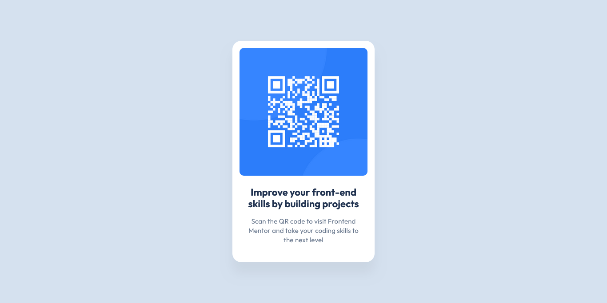

# Frontend Mentor - QR code component solution

This is a solution to the [QR code component challenge on Frontend Mentor](https://www.frontendmentor.io/challenges/qr-code-component-iux_sIO_H). Frontend Mentor challenges help you improve your coding skills by building realistic projects.

## Table of contents

- [Overview](#overview)
  - [Screenshot](#screenshot)
  - [Links](#links)
- [My process](#my-process)
  - [Built with](#built-with)
  - [What I learned](#what-i-learned)
- [Author](#author)

## Overview

### Screenshot

### Links

- :zap: [The project code can be found here](https://github.com/jsklcodes/qr-code-component)
- :rocket: [Check out the project demo here](https://jsklcodes.github.io/qr-code-component/)

## My process

### Built with

- Semantic HTML5 markup
- CSS custom properties
- BEM methodology

### What I learned

I created this project with the goal of reviewing HTML and CSS. Despite its simplicity, the main lesson was about organization. From the start, I focused on structuring my code to be clear, readable, and semantic, both in HTML and CSS. Additionally, I paid special attention to maintaining a consistent and coherent versioning throughout development.

## Author

- Frontend Mentor - [@jsklcodes](https://www.frontendmentor.io/profile/jsklcodes)
